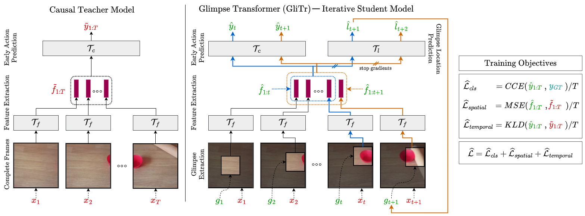
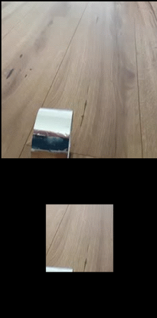
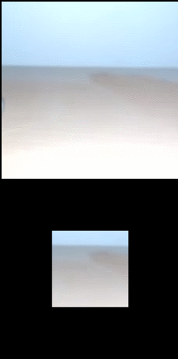

# GliTr: Glimpse Transformers with Spatiotemporal Consistency for Online Action Prediction
**Authors**: Samrudhdhi Rangrej, Kevin Liang, Tal Hassner, James Clark
**Accepted to**: WACV'23
[Paper](https://openaccess.thecvf.com/content/WACV2023/papers/Rangrej_GliTr_Glimpse_Transformers_With_Spatiotemporal_Consistency_for_Online_Action_Prediction_WACV_2023_paper.pdf)
&nbsp;

&nbsp;

&nbsp;

**An overview of our GliTr.** GliTr consists of a frame-level spatial transformer $\mathcal{T}$$f$ and causal temporal transformers $\mathcal{T}$$c$ and $\mathcal{T}$$l$. One training iteration requires $T$ forward passes through our model. Above, we show two consecutive forward passes at time $t \leq T-1$ and $t+1 \leq T$.

**Forward pass $t$** (blue path): Given a new glimpse $g_t$, $T_f$ extracts glimpse-features $\hat{f}$$t$. We append $\hat{f}$$t$ to $\hat{f}$$1:t-1$, i.e., features extracted from $g_{1:t-1}$ during previous passes. Next, $\mathcal{T}$$c$ predicts label $\hat{y}$$t$ from $\hat{f}$$1:t$. Simultaneously, $\mathcal{T}$$l$ predicts next glimpse location $\hat{l}$${t+1}$ from $\hat{f}$${1:t}$. 

**Forward pass $t+1$** (orange path): Given a predicted location $\hat{l}$${t+1}$, we extract a glimpse $g_{t+1}$ at $\hat{l}$${t+1}$ from a frame $x_{t+1}$. Then, we follow the same steps as the blue path. After $T$ forward passes, we compute the losses shown in the right. To find targets $\tilde{y}$${1:T}$ and $\tilde{f}$${1:T}$ for spatial and temporal consistency, we use a separate pre-trained and fixed teacher model (shown on the left) that observes complete frames $x_{1:T}$. To maintain stability, we stop gradients from $\mathcal{T}$$l$ to $\mathcal{T}$$f$.
&nbsp;

## Requirements
* numpy==1.19.2
* torch==1.8.1
* torchvision==0.9.1 
* wandb==0.12.9
* timm==0.4.9

## Datasets
* [Jester](https://developer.qualcomm.com/software/ai-datasets/jester)
* [Something-Something V2](https://developer.qualcomm.com/software/ai-datasets/something-something)

Prepare both datasets following instructions for Something-Something V2 dataset provided in [TSM repository](https://github.com/mit-han-lab/temporal-shift-module).

## Experiment Setup

**Note:** Create and set following paths in [SSv2_Teacher.sh](https://github.com/samrudhdhirangrej/GliTr/blob/main/SSv2_Teacher.sh), [Jester_Teacher.sh](https://github.com/samrudhdhirangrej/GliTr/blob/main/Jester_Teacher.sh), [SSv2_GliTr.sh](https://github.com/samrudhdhirangrej/GliTr/blob/main/SSv2_GliTr.sh) and [Jester_GliTr.sh](https://github.com/samrudhdhirangrej/GliTr/blob/main/Jester_GliTr.sh).

* `PRETRAINED_DIR="/absolute/path/to/directory/with/pretrained/weights/"`
* `OUTPUT_DIR="/absolute/path/to/output/directory/"`
* `DATA_DIR="/absolute/path/to/data/directory/"`
* `LOG_DIR="/absolute/path/to/log/directory/"`

Download and store following pretrained models in `PRETRAINED_DIR`.
* ViT-S/16 teacher weights from [ibot repository](https://github.com/bytedance/ibot)
  - Rename it to `ibot_vits_16_checkpoint_teacher.pth`.
* VideoMAE ViT-B (epoch 2400) finetuning weights for Something-Something V2 dataset from [VideoMAE repository](https://github.com/MCG-NJU/VideoMAE)
  - Rename it to `videomae_ssv2_ep2400_vitB.pth`.

## Training and Evaluation
1. Run [SSv2_Teacher.sh](https://github.com/samrudhdhirangrej/GliTr/blob/main/SSv2_Teacher.sh)
2. Run [Jester_Teacher.sh](https://github.com/samrudhdhirangrej/GliTr/blob/main/Jester_Teacher.sh) (Set `JESTER_PRETRAINED="/absolute/path/to/learnt/ssv2/teacher/weights/"`)
3. Run [SSv2_GliTr.sh](https://github.com/samrudhdhirangrej/GliTr/blob/main/SSv2_GliTr.sh) (Set `TEACHER_CHECKPOINT="/absolute/path/to/teacher/weights/"`)
4. Run [Jester_GliTr.sh](https://github.com/samrudhdhirangrej/GliTr/blob/main/Jester_GliTr.sh) (Set `TEACHER_CHECKPOINT="/absolute/path/to/teacher/weights/"`)

## Visualization

 &nbsp;  &nbsp;  &nbsp;  &nbsp; 

**Glimpses selected by GliTr on Something-Something v2 dataset.** The complete frames are shown for reference only. GliTr does not observe full frames. It only observes glimpses.

## Acknowledgement
Our code is based on: [deit](https://github.com/facebookresearch/deit), [TSM](https://github.com/mit-han-lab/temporal-shift-module), [timm](https://github.com/rwightman/pytorch-image-models/), [AR-Net](https://github.com/mengyuest/AR-Net), [catalyst](https://github.com/catalyst-team/catalyst), [VideoMAE](https://github.com/MCG-NJU/VideoMAE), [STAM-Sequential-Transformers-Attention-Model](https://github.com/samrudhdhirangrej/STAM-Sequential-Transformers-Attention-Model)

